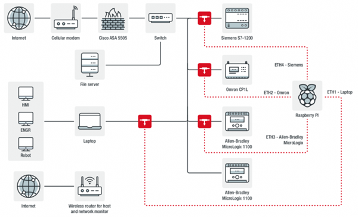

# Honeypots (ฮอนนี่พอร์ต) คืออะไร

ปัจจุบันการทำงานบนเครือข่ายคอมพิวเตอร์ มีมากมาย การทำใช้งานต่าง ๆ สามารถเกิดการมีช่องโหว่ การเสี่ยงต่อการใช้งานได้ การเกิดการโจรกรรมต่าง ๆ สามารถเกิดขึ้นได้ตลอดเวลา เช่น การแอบดักจับข้อมูล เพื่อเอาไปทำผลประโยชน์ต่อตนเอง จะมาพูดถึง Honeypots การดักจับเข้ามาในเครือข่ายเพื่อทำการล่อลวง

Honeypots (ฮอนนี่พอร์ต) เป็นระบบข้อมูลไฟร์วอล หรือเว็บเซิร์ฟเวอร์ฐานข้อมูลไฟล์ต่าง ๆ เหมือนระบบทั่วไป เป็นการดักจับแล้วทำการล่อลวงเข้ามาในเครือข่ายที่รู้จักกันว่า แฮ็คเกอร์ Honeypots เป็นเครื่องที่เปิดช่องช่องโหว่ของระบบอื่น ๆ ได้มากมาย ทำให้สามารถเข้ามาโจรกรรมข้อมูลได้ง่าย ลักษณะ Honeypots มาใช้งาน คือ นำมาใช้ในงานวิจัย ที่ผู้โจมตีระบบเข้ามา แล้วศึกษาการทำงานของไวรัส ต่าง ๆ และ นำมาใช้เพื่อลดความเสี่ยงจากการถูกโจมตี เพื่อให้โจมตี Honeypots แทนระบบจริง 

Honeypots (ฮอนนี่พอร์ต) ยังช่วยตรวจสอบการบุกรุกและแจ้งเตือนการบุกรุกเมื่อมีการบุกรุกข้อมาในระบบ Honeypots จะติดตั้งใว้ในเครือข่ายเดียวกับระบบจริงเพื่อที่จะสามารถเข้าถึงและรู้ระบบการทำงานได้จะช่วยให้การตรวจสอบไดง่ายมากยิ่งขึ้น

> ขอบคุณข้อมูลจาก: https://www.mindphp.com/%E0%B8%9A%E0%B8%97%E0%B8%84%E0%B8%A7%E0%B8%B2%E0%B8%A1/244-security/5742-honeypots-security.html

---

## **ตัวอย่างเหตุการณ์เกี่ยวกับการใช้ Honey Pot**
**นักวิจัยตั้ง Honeypot จำลองระบบในอุตสาหกรรมเพื่อศึกษาการโจมตีจริง**
ทีมนักวิจัยด้านความมั่นคงปลอดภัยจาก Trend Micro ได้ตั้ง Honeypot ปลอมเป็นองค์กรภาคอุตสาหกรรมที่ใช้ระบบ เช่น ICS, PLC และอื่นๆ โดยผลลัพธ์ชี้ว่าผู้ดูแลระบบมีความเสี่ยงจากคนร้ายทั่วไปที่หวังผลทางการเงินมากกว่ากลุ่มแฮ็กเกอร์ระดับชาติ

>Credit: Trend Micro

Honeypot ถูกจำลองให้เสมือนจริงมากที่สุดซึ่งภายในประกอบด้วยฮาร์ดแวร์ ICS เช่น Siemens, Allen-Bradley และ Omron รวมถึง VM ที่รัน HML เพื่อควบคุมโรงงานและเครื่อง Workstation ที่ควบคุม Palletizer และใช้ในการโปรแกรม PLC นอกจากนี้ยังมี Physical Host File Server และ VM อื่นๆ โดยนักวิจัยได้สร้างบริษัทปลอมขึ้นมาที่อ้างตัวเป็นโรงงานขนาดเล็กเพื่อให้บริการงานพิเศษบางอย่างแก่ลูกค้าเฉพาะ นอกจากนี้ยังสร้างหน้าเว็บขึ้นมาและใส่เบอร์โทรศัพท์เอาไว้แต่ตอบรับด้วยบันทึกเสียงแทน

สำหรับการล่อหลอกนักวิจัยตั้งใจเปิดบางพอร์ตเอาไว้ เช่น VNC ที่ไม่มีรหัสผ่าน, PLC และ Ethernet/IP โดยทำการบล็อกเครื่องมือค้นหาทั่วไปอย่าง Shodan, ZoomEye และ Shadowserver เพื่อคัดกรองการสแกนธรรมดาออกไป อย่างไรก็ตามหลังการศึกษาระบบจำลองถึง 7 เดือน นักวิจัยสรุปว่ากลุ่มแฮ็กเกอร์ที่เข้ามาโจมตีหวังผลทางการเงิน เช่น แรนซัมแวร์ Cryptojacking และการใช้ระบบในการปลอมแปลงกิจกรรมบางอย่าง ทั้งนี้กิจกรรมของแฮ็กเกอร์ที่น่าสนใจคือความพยายามใช้คำสั่งแปลกๆ หรือการสั่งปิดเปิดระบบ หรือ Service เพื่อดูผลลัพธ์ด้วยความใคร่รู้ของแฮ็กเกอร์นั่นเอง

อย่างไรก็ตามจากผลลัพธ์ที่เกิดขึ้นนักวิจัยสรุปว่าระบบอุตสาหกรรมก็ต้องกังวลเกี่ยวกับแฮ็กเกอร์ที่หวังผลทางการเงิน แทนที่จะมองภาพแค่แฮ็กเกอร์ระดับรัฐสนับสนุน (State-sponsor) นอกจากนี้ยังหมายถึงว่ายังไงระบบ ICS หรือการใช้งานในอุตสาหกรรมของคุณก็มีความเสี่ยงเสมอ ดังนั้นดูแลทุกส่วนให้ดีครับ ผู้สนใจเพิ่มเติมสามารถติดตามได้จาก PDF ของ Trend Micro

> ขอบคุญข้อมูลจาก: https://www.techtalkthai.com/trend-micro-honeypot-for-evaluate-risk-of-industrial-system/